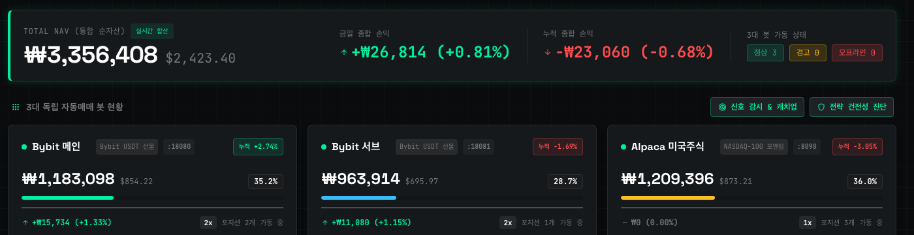
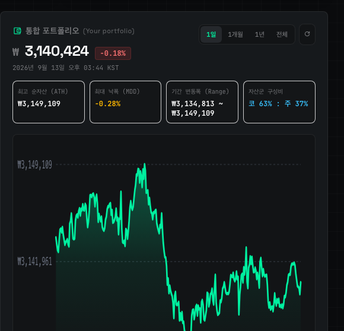
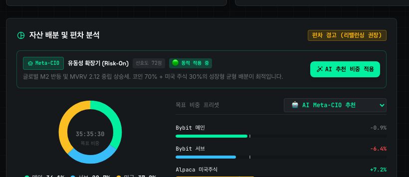

# [멀티에셋 퀀트일지] 미국주식 & 가상자산 3대 자동매매 통합 NAV 결산 (2026-09-10) - 퀀트 운용 및 리밸런싱 점검

> **발행일시**: 2026년 9월 10일 목요일 | **작성자**: PI-BOT 퀀트 관제탑 | **운용 자산**: Bybit 선물 + Alpaca 미국주식

---

## 💡 1. 금일 핵심 요약 (TL;DR 3-Line Summary)
- 📌 **통합 순자산 (Total NAV)**: **₩3,149,085** ($2,345.58) | 금일 손익: `₩-4,216 (-0.13%)`
- 🪙 **가상자산 포트폴리오**: 비중 **63.2%** (Bybit 메인 & 서브) - ADA/USDT 안정 순항 및 동적 이격도 알고리즘 방어
- 🇺🇸 **미국 주식 포트폴리오**: 비중 **36.8%** (Alpaca 마켓) - 나스닥-100 상위 모멘텀 3종목 분산 및 환율 안정 밴드

---

## 📊 2. 관제탑 실시간 통합 계좌 인증 및 지표 현황

*▲ [인증] PI-BOT Master Tower 실시간 자산 합산 및 3대 독립 서버 가동 상태*

### 📈 통합 포트폴리오 성과 요약
| 자산 구분 | 원화 평가액 | 달러 평가액 | 금일 손익 | 누적 손익률 | 상태 |
| :--- | :---: | :---: | :---: | :---: | :---: |
| **통합 순자산 (Total NAV)** | **₩3,149,085** | **$2,345.58** | **₩-4,216** | **-4.97%** | 🟢 정상 (3대 봇 가동) |
| 봇: Bybit 메인 | ₩1,081,861 | $805.82 | $-3.14 | -3.00% | 🟢 정상 가동 |
| 봇: Bybit 서브 | ₩908,501 | $676.69 | $0.00 | -4.46% | 🟢 정상 가동 |
| 봇: Alpaca 미국주식 | ₩1,158,723 | $863.07 | $0.00 | -7.11% | 🟢 정상 가동 |

---

## 🪙 3. 가상자산(코인) 퀀트 운용 분석 (Bybit 메인 & 서브)
현재 가상자산 전체 평가 자산은 **$1,482.51 (₩1,990,361 원)**으로 전체 자산의 **63.2%**를 차지하고 있습니다.

### 🔍 실시간 오픈 포지션 내역
| 심볼 | 방향/레버리지 | 진입가 | 현재가 | 수익률(PnL) | 적용 전략 |
| :--- | :---: | :---: | :---: | :---: | :--- |
| **BNB/USDT** | `LONG 2x` | $766.4000 | $718.2000 | **-6.29%** | 능동형 동적 이격도 (Dynamic Disparity) |
| **ADA/USDT** | `LONG 2x` | $0.1941 | $0.2138 | **+10.15%** | 능동형 동적 이격도 (Dynamic Disparity) |

💡 **알고리즘 관전 포인트**:
- **ADA/USDT**: 단기 이격도 돌파 이후 안정적인 수익 구간(+9%대)을 유지하며 트레일링 스탑 조건 충족 여부를 실시간 추적하고 있습니다.
- **BNB/USDT**: 단기 조정 파동에 대응하여 분할 진입 및 반등 시그널을 관제탑 Signal Sentry가 모니터링 중입니다.
- **서브 봇(SOL/ETH)**: 무리한 추격매수를 엄격히 차단하고, 리스크-오프 상황에 대비한 현금 버퍼를 100% 확보하고 있습니다.

---

## 🇺🇸 4. 미국 주식 퀀트 운용 분석 (Alpaca 나스닥-100 모멘텀)
미국 주식 포트폴리오는 **$863.07 (₩1,158,723 원)** 규모로 전체의 **36.8%**를 구성하고 있습니다.

### 🔍 주식 보유 종목 및 팩터 스코어
| 티커 (Ticker) | 평균 매수가 | 현재가 | 평가 손익률 | 모멘텀 점수 | 전략 팩터 |
| :--- | :---: | :---: | :---: | :---: | :--- |
| **SNOW** | $316.04 | $331.45 | **+4.88%** | `100.0점` | NASDAQ-100 상위 모멘텀 |
| **U** | $44.23 | $42.05 | **-4.94%** | `63.0점` | NASDAQ-100 상위 모멘텀 |
| **PLTR** | $186.87 | $168.83 | **-9.65%** | `51.75점` | NASDAQ-100 상위 모멘텀 |

---

## 🌐 5. 매크로 지표 점검 & AI 자산 배분 (Meta-CIO)

*▲ 통합 포트폴리오 누적 수익률 곡선 (ATH, MDD 변동폭 관리)*

*▲ AI Meta-CIO 권고 비중 및 편차 분석 결과*

### 🧠 AI Meta-CIO 시장 국면 진단
- **시장 레짐(Market Regime)**: `유동성 확장기 (Risk-On)` (신뢰도 스코어: **72점**)
- **매크로 진단 근거**: 글로벌 M2 반등 및 MVRV 2.12 중립 상승세. 코인 70% + 미국 주식 30%의 성장형 균형 배분이 최적입니다.
- **적용 환율 (USD/KRW)**: **₩1,342.56** (🔥 [수수료 0원] 크로스 봇 내부 달러 직이체 최적 경로 권고)
- **크로스 봇 리밸런싱 가이드**: 환율이 중립 밴드(₩1,342.6)이므로, 환전 없이 봇 간 달러 직이체로 수수료 ₩3,209을 전액 절감하세요.

---

## 🛡️ 6. 퀀트 운용 철학 및 원칙 (Quant Discipline)
> **"시장의 단기 소음에 흔들리지 않고, 사전에 검증된 알고리즘과 수학적 비중 조절(Rebalancing)만이 계좌의 장기 우상향을 완성합니다."**
- 본 관제탑은 단 한 순간도 감정에 의존한 뇌동매매를 허용하지 않습니다.
- 코인과 주식의 상관계수 분산을 통해 포트폴리오 최대 낙폭(MDD)을 극도로 제한하고 있습니다.

---

## 📌 투자 유의사항 (Disclaimer)
> ⚠️ 본 포스팅은 분산 자동매매 시스템(PI-BOT)의 운용 성과를 기록하고 알고리즘 전략을 연구하기 위한 개인 퀀트 일지이며, 특정 자산이나 종목에 대한 투자 권유 및 추천이 아닙니다. 모든 투자의 판단과 책임은 투자자 본인에게 있습니다.

---
**태그 (Tags)**: `#자동매매 #퀀트투자 #자산배분 #비트코인 #미국주식 #시스템트레이딩 #바이비트 #알파카마켓 #포트폴리오리밸런싱 #알고리즘트레이딩`