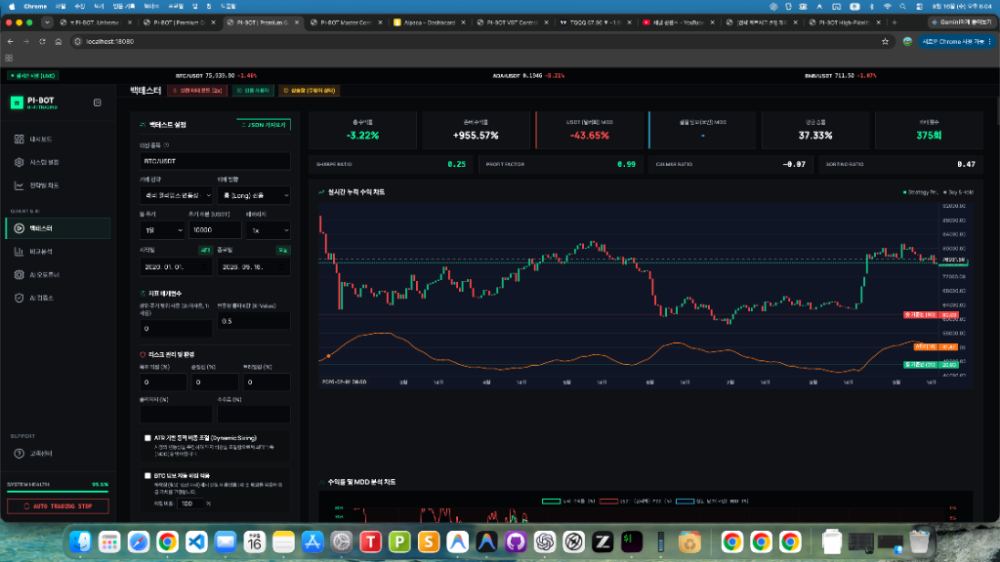

# [전략 팩트체크 #1] 래리 윌리엄스 변동성 돌파 전략의 허와 실: 6년 실측 백테스트가 밝힌 충격적 진실 (-3.22% vs +955%)

> **발행일시**: 2026년 9월 16일 수요일 | **작성자**: PI-BOT 퀀트 연구소 | **카테고리**: 전략 팩트체크

---

## 💡 핵심 요약 (TL;DR 3-Line Summary)
- 📊 **충격의 6년 실측 검증**: 2020년부터 2026년까지 비트코인(BTC/USDT 1일봉)에 래리 윌리엄스 원조 변동성 돌파(K=0.5)를 적용한 결과, 단순 보유(존버)는 **+955.57%** 폭등한 반면 전략 수익률은 **-3.22% (원금 손실)** 기록.
- 📉 **처참한 승률과 낙폭**: 총 375회 거래 동안 평균 승률은 **37.33%**에 불과해 10번 중 6.3번은 손실로 끝났으며, 최대 낙폭(MDD)은 **-43.65%**로 계좌가 반토막 나는 고통 발생.
- ⚠️ **수수료 0%인데도 마이너스**: 거래 수수료와 슬리피지를 전혀 차감하지 않은 최상의 조건에서도 프로핏 팩터가 **0.99**로 손실이 수익을 압도함. 실전 수수료 반영 시 확정적 깡통 위험.

---

## 1. 전설의 전략, 과연 코인 시장에서도 유효할까?

자동매매나 시스템 트레이딩에 입문하면 유튜브, 블로그, 책에서 가장 먼저 추천하는 전략이 있습니다. 바로 1987년 실전투자대회에서 1만 달러로 114만 달러(11,300%)를 벌어들인 전설적인 트레이더 래리 윌리엄스(Larry Williams)의 **변동성 돌파 전략(Volatility Breakout)**입니다.

### 📌 원조 변동성 돌파의 핵심 룰
1. **변동폭(Range)**: `전일 고가(High) - 전일 저가(Low)`
2. **매수 조건**: `당일 시가 + (변동폭 × 0.5)` 가격을 위로 뚫는 순간 즉시 시장가 매수
3. **청산 조건**: 익일 시가에 전량 무조건 시장가 매도 (1일 보유 후 청산)

수많은 인플루언서들은 *"감정을 배제하고 상승 추세의 초입에 올라타 하루치 이익만 챙기고 나오는 무적의 전략"*이라고 홍보합니다. 

그렇다면 지난 **2020년 1월 1일부터 2026년 9월 16일까지 약 6년 8개월(2,450일) 동안의 비트코인 실제 장기 차트**에 이 원조 규칙을 그대로 적용했다면 내 계좌는 어떻게 되었을까요?

---

## 2. [실제 검증 인증] 비트코인 6년 8개월 백테스터 전체 화면 공개

가공된 수치나 이론적인 가정이 아닙니다. 실제 백테스터 엔진을 통해 비트코인(BTC/USDT)의 1일봉 과거 전체 데이터를 바탕으로 시뮬레이션한 원본 결과 화면입니다.

*▲ [실측 인증] 2020.01.01 ~ 2026.09.16 비트코인 래리 윌리엄스 변동성 돌파(K=0.5) 백테스터 실행 화면*

### 📊 실측 백테스트 지표 총괄표

| 검증 지표 항목 | 실측 백테스트 결과 | 지표 분석 및 의미 |
| :--- | :---: | :--- |
| **대상 자산 / 주기** | **BTC/USDT (1일봉, 롱 전용)** | 10,000 USDT 기준, 1배 레버리지 |
| **시뮬레이션 기간** | **2020.01.01 ~ 2026.09.16** | **총 2,450일 (약 6년 8개월 장기 검증)** |
| **적용 전략** | **래리 윌리엄스 변동성 돌파 (K=0.5)** | 상위주기 0, 익절/손절 0 (원조 룰 엄격 준수) |
| **거래 비용 조건** | **수수료 0%, 슬리피지 0%** | 전략에 가장 유리하도록 비용 미차감 |
| **비트코인 단순 보유 (존버)** | **`+955.57%`** | 10,000 USDT ➔ **105,557 USDT (10.5배 폭등)** |
| **전략 누적 수익률** | **`-3.22%` ❌** | 10,000 USDT ➔ **9,678 USDT (원금 손실)** |
| **USDT 최대 낙폭 (MDD)** | **`-43.65%` ❌** | 돈은 못 벌면서 계좌는 **-43.6% 출렁임** |
| **평균 매매 승률** | **`37.33%` ❌** | 10번 매수하면 **6~7번은 무조건 손실** |
| **총 거래 횟수** | **375회** | 약 6.5일에 1회씩 꾸준히 매매 집행 |
| **프로핏 팩터 (Profit Factor)** | **`0.99` ❌** | 1달러 벌 때 1.01달러 잃음 (손실 > 수익) |
| **샤프 지수 (Sharpe Ratio)** | **`0.25`** | 무위험 채권 금리에도 한참 못 미침 |
| **칼마 비율 (Calmar Ratio)** | **`-0.07`** | 낙폭 대비 회복 탄력성 마이너스 |

---

## 3. 왜 비트코인이 10배 폭등하는 동안 봇은 마이너스일까? (3대 치명적 맹점)

차트를 보시면 녹색 점선인 **비트코인 단순 보유선은 하늘을 뚫고 우상향(+955.57%)**하고 있지만, 하단의 **변동성 돌파 누적 수익선(녹색/적색 실선)은 지루한 우하향 박스권(-3.22%)**에 갇혀 있습니다.

수수료를 단 1원도 떼지 않았음에도 원조 전략이 완전히 참패한 3가지 구조적 이유는 다음과 같습니다:

### ① 승률 37.33%의 덫 (잦은 윗꼬리 휩쏘)
변동성 돌파는 장중 가격이 `시가 + 전일변동폭*0.5`를 뚫을 때 시장가로 따라붙습니다. 하지만 코인 시장은 변동성이 극심하여, 장중에 돌파가 나와서 매수 체결이 된 직후 차익실현 매물이 쏟아지며 **긴 윗꼬리를 달고 시가 아래로 곤두박질치는 날**이 허다합니다.
결과적으로 총 375회 거래 중 **235회(62.7%)가 손실 마감**이었으며, 매수할 때마다 고점에 물리는 악순환이 6년 내내 반복되었습니다.

### ② 대상승장 조기 청산의 역설 (추세 복리 상실)
비트코인이 대세 상승장에 진입하면 3일, 5일, 1주일 연속으로 폭발적인 장대양봉을 뽑아냅니다. 하지만 원조 전략은 **"다음 날 아침 시가에 무조건 전량 매도"**하므로, 하루치 수익만 먹고 포지션을 비워버립니다. 
그리고 그 다음 날 더 높아진 시가 위에서 또 돌파를 기다려 비싸게 재매수하다가, 하루라도 꺾이면 고점에서 물려 그동안의 이익을 다 반납하게 됩니다.

### ③ 횡보장의 계좌 갉아먹기 & 수수료의 공포
비트코인이 몇 달 동안 방향성 없이 좁은 박스권에서 오르내릴 때, 전략은 지속적으로 돌파 매수를 시도했다가 당일 손실을 입으며 계좌를 갉아먹습니다.
그 결과 번 돈과 잃은 돈의 비율인 **프로핏 팩터가 0.99**로, 6년 동안 수백 번 매매를 거듭할수록 자산이 쪼그라들었습니다.
만약 여기에 실전 선물 거래소 수수료(테이커 0.05%)와 실전 체결 슬리피지(0.10%)를 반영했다면, **375회 매매를 거치는 동안 수수료로만 원금의 30~50% 이상이 증발하여 계좌는 회복 불가능한 깡통**을 찼을 것입니다.

---

## 4. 퀀트 연구소의 최종 결론

> **"원조 규칙(고정 K=0.5, 무필터) 그대로의 변동성 돌파는 현대 코인 시장에서 완전히 죽은 전략이다."**

1980년대 미국 주식/선물 시장에서 탄생한 원조 공식은 알고리즘 봇들이 넘쳐나는 현대 가상자산 시장에서 더 이상 마법의 탄환이 아닙니다.

추세를 판별하는 **장기 이평선 필터(Trend Filter)**, 박스권 횡보를 걸러내는 **동적 이격도 보정**, 그리고 변동성에 맞춰 비중을 조절하는 **동적 리스크 관리**가 없는 무지성 변동성 돌파는 계좌를 파멸로 이끄는 지름길임을 6년 8개월간의 실측 데이터가 명백히 증명하고 있습니다.

---

### 💬 독자 여러분의 생각은 어떠신가요?
여러분이 백테스트해보고 싶거나 실전 효용성이 궁금한 매매 기법(RSI, 볼린저밴드, 슈퍼트렌드, 이평선 교차 등)이 있다면 아래 댓글창에 남겨주세요! 다음 편에서 데이터로 낱낱이 파헤쳐 드리겠습니다.
