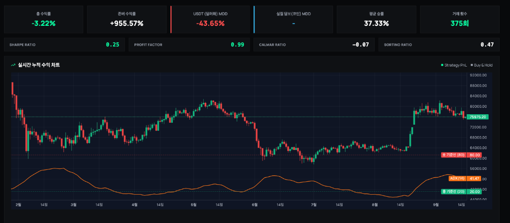
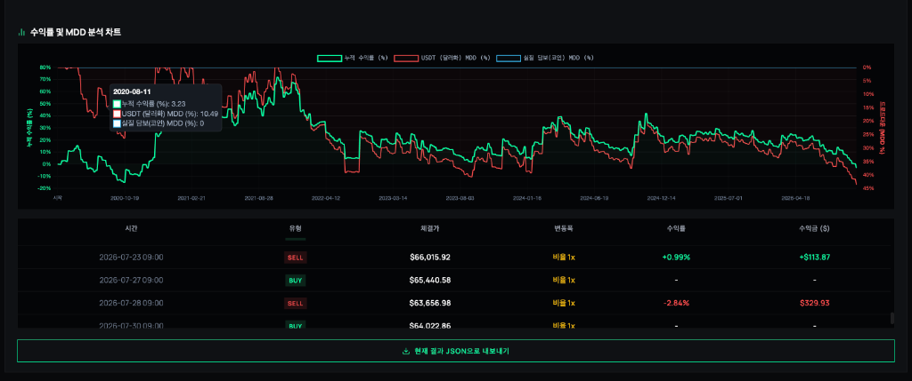
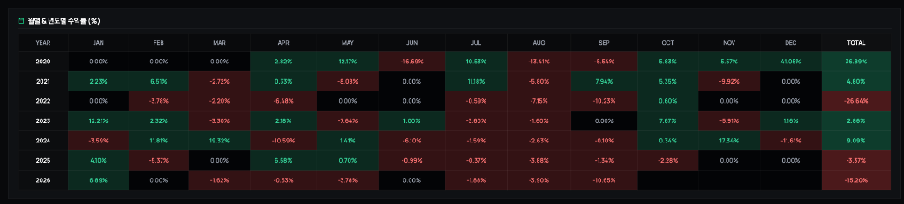

# [전략 팩트체크 #1] 래리 윌리엄스 변동성 돌파 전략의 허와 실: 6년 실측 백테스트가 밝힌 충격적 진실 (-3.22% vs +955%)

> **발행일시**: 2026년 9월 16일 수요일 | **작성자**: PI-BOT 퀀트 연구소 | **카테고리**: 전략 팩트체크

---

## 💡 핵심 요약 (TL;DR 3줄 요약)
- 📊 **충격의 6년 8개월 실측 검증**: 2020년부터 2026년까지 비트코인(BTC/USDT 1일봉)에 래리 윌리엄스 변동성 돌파(K=0.5)를 적용한 결과, 단순 보유(존버)는 **+955.57%** 폭등한 반면 전략 수익률은 **-3.22% (원금 손실)** 기록.
- 📉 **필터(ADX)와 수수료 0%의 착시**: 장중 속임수를 피하고자 ADX 추세 필터까지 걸고 거래 수수료를 0%로 둔 최상의 조건에서도, 승률은 **37.33%**에 그치고 최대 낙폭(MDD)은 **-43.65%**까지 추락.
- ⚠️ **구조적 3대 맹점**: ① 잦은 윗꼬리 휩쏘로 10번 중 6.3번 손실 청산, ② 익일 시가 매도로 인한 대상승장 복리 기회 상실, ③ 횡보장 계좌 갉아먹기(Profit Factor 0.99).

---

## 1. 전설의 전략, 과연 코인 시장에서도 유효할까?

자동매매나 퀀트 투자를 처음 공부할 때 99%가 가장 먼저 접하는 전략이 바로 1987년 실전투자대회에서 1만 달러로 114만 달러(11,300%)를 벌어들인 전설적인 트레이더 래리 윌리엄스(Larry Williams)의 **변동성 돌파 전략(Volatility Breakout)**입니다.

- **변동폭(Range)**: `전일 고가(High) - 전일 저가(Low)`
- **매수 조건**: `당일 시가 + (변동폭 × 0.5)` 가격을 위로 뚫는 순간 즉시 시장가 매수
- **청산 조건**: 익일 시가에 전량 무조건 시장가 매도 (1일 보유 후 청산)

수많은 유튜브와 블로그에서는 *"감정을 배제하고 상승 추세의 초입에 올라타 하루치 이익만 챙기고 나오는 무적의 전략"*이라며 찬양합니다. 

그렇다면 지난 **2020년 1월 1일부터 2026년 9월 16일까지 약 6년 8개월(2,450일) 동안의 비트코인 실제 장기 차트**에 이 전략을 적용했을 때의 진짜 성적표는 어떨까요? 불필요한 브라우저 화면을 걷어내고, 실제 백테스터의 핵심 데이터 3개 영역을 낱낱이 파헤쳐 봅니다.

---

## 2. [검증 1] 핵심 지표 & 실시간 누적 수익 차트

가공된 이론치가 아닙니다. 실제 백테스터 엔진을 통해 비트코인(BTC/USDT)의 1일봉 과거 전체 데이터를 바탕으로 시뮬레이션한 원본 결과입니다.

*▲ [실측 인증 1] 핵심 성과 요약 카드와 실시간 누적 수익 차트 (Strategy PnL vs Buy & Hold)*

### 📊 실측 백테스트 지표 총괄표

| 검증 지표 항목 | 실측 백테스트 결과 | 지표 분석 및 의미 |
| :--- | :---: | :--- |
| **대상 자산 / 주기** | **BTC/USDT (1일봉, 롱 전용)** | 10,000 USDT 기준, 1배 레버리지 |
| **검증 기간** | **2020.01.01 ~ 2026.09.16** | **총 2,450일 (약 6년 8개월 장기 검증)** |
| **적용 전략** | **래리 윌리엄스 변동성 돌파 (K=0.5)** | ADX(14) 추세 필터 적용, 수수료 0% 기준 |
| **비트코인 단순 보유 (존버)** | **`+955.57%`** | 10,000 USDT ➔ **105,557 USDT (10.5배 폭등)** |
| **전략 누적 수익률** | **`-3.22%` ❌** | 10,000 USDT ➔ **9,678 USDT (원금 손실)** |
| **USDT 최대 낙폭 (MDD)** | **`-43.65%` ❌** | 돈은 못 벌면서 계좌는 **-43.6% 출렁임** |
| **평균 매매 승률** | **`37.33%` ❌** | 10번 매수하면 **6~7번은 무조건 손실** |
| **총 거래 횟수** | **375회** | 약 6.5일에 1회씩 꾸준히 매매 집행 |
| **프로핏 팩터 (Profit Factor)** | **`0.99` ❌** | 1달러 벌 때 1.01달러 잃음 (손실 > 수익) |
| **샤프 지수 (Sharpe Ratio)** | **`0.25`** | 무위험 채권 금리에도 한참 못 미침 |
| **칼마 비율 (Calmar Ratio)** | **`-0.07`** | 낙폭 대비 회복 탄력성 마이너스 |

> 💡 **참고: 필터까지 걸었는데도 왜 마이너스일까?**  
> 이번 실측 데이터는 무지성 매수를 방지하기 위해 **ADX(14) 추세 강도 필터**까지 결합하고 수수료를 0%로 둔 상태였습니다. 그럼에도 불구하고 총수익률은 **-3.22%**로 원금을 까먹었습니다. 단순한 기술적 보조지표 필터 하나로는 횡보장 휩쏘를 원천 차단하기 어렵다는 뜻입니다.

---

## 3. [검증 2] 수익률 및 MDD 낙폭 곡선과 실제 매매 체결 로그

*▲ [실측 인증 2] 누적 수익률(녹색선) vs USDT MDD 낙폭(적색선) 및 실제 SELL/BUY 체결 내역*

### 🔍 차트와 체결 내역이 증명하는 2가지 진실

1. **-43.65%라는 잔혹한 드로다운 (적색 낙폭선)**:
   - 상단 차트에서 적색 선(USDT MDD)을 보면, 2021년 고점 이후 2022년 하락장 내내 -30%~-43%의 깊은 수렁에 갇혀 있었습니다.
   - 수익률(녹색선)은 2020년 반짝 상승한 이후 6년 내내 원금 근처에서 횡보하다 결국 0% 아래로 침몰했습니다.
2. **실제 체결 로그의 악순환**:
   - 하단 체결표를 보면 `SELL +0.99% (+$113)`로 찔끔 먹은 뒤, 곧바로 다음 거래에서 `SELL -2.84% (-$329)`로 크게 물려 토해내는 전형적인 **"찔끔 먹고 크게 털리는"** 패턴이 적나라하게 나타납니다.
   - 장중 돌파 시점에 시장가로 진입하지만, 코인 시장 특유의 급격한 윗꼬리(Dead Cat Bounce)에 걸려 고점에 물린 뒤 다음 날 아침 손절당하는 것입니다.

---

## 4. [검증 3] 6개년(2020~2026) 연도별 & 월별 수익률 히트맵

*▲ [실측 인증 3] 2020년부터 2026년까지의 월별/연도별 수익률 매트릭스 (%)*

### 📅 연도별 성적표 요약

- **2020년: `+36.89%`** (코로나 팬데믹 이후 유동성 대폭발 시기, 유일한 호황)
- **2021년: `+4.80%`** (비트코인이 69,000달러를 찍으며 역사적 불장을 달렸는데, 전략은 고작 4.8%?)
- **2022년: `-26.64%`** (대세 하락장에서 연간 -26% 폭락하며 계좌 붕괴)
- **2023년: `+2.86%`** (비트코인 100% 반등하는 동안 제자리걸음)
- **2024년: `+9.09%`** (비트코인 신고가 랠리에도 한 자릿수 수익에 그침)
- **2025년: `-3.37%`** (지루한 박스권에서 손실 마감)
- **2026년: `-15.20%`** (연초부터 연이은 손절로 -15% 급락)

### 📌 히트맵이 말해주는 결정적 결함: "상승장 복리 기회 상실"
비트코인이 몇 배씩 폭등했던 2021년과 2024년에 전략 수익률은 고작 4%와 9%에 불과했습니다.  
이유는 간단합니다. 비트코인이 며칠 연속으로 50%씩 오를 때, 전략은 **"다음 날 아침 시가에 무조건 전량 매도"**하므로 랠리의 90%를 놓치고, 꼭대기에서 재진입했다가 물리기 때문입니다.

---

## 5. 퀀트 연구소의 최종 결론

> **"원조 규칙 그대로의 변동성 돌파는 현대 코인 시장에서 완전히 수명을 다한 전략이다."**

1980년대 미국 선물 시장에서 탄생한 원조 룰은 24시간 365일 고변동성 휩쏘가 난무하는 현대 가상자산 시장에서 마법의 무기가 될 수 없습니다.

- **수수료를 0%로 쳐주어도 원금 손실(-3.22%)**이며,
- **ADX 추세 필터를 걸어도 승률은 37%**에 불과하며,
- 실전 선물 거래소 수수료(테이커 0.05%)와 슬리피지(0.10%)를 넣는 순간 **375번의 매매 동안 계좌의 절반 이상이 거래 비용으로 증발**합니다.

따라서 변동성 돌파 전략을 실전에서 사용하려면, 단순한 지표 조합이 아니라 **시장 국면(레짐)에 따라 진입 자체를 차단하는 상위 필터**, 그리고 **미국 주식이나 현금 자산과의 엄격한 자산배분**이 없이는 결코 장기 우상향을 달성할 수 없습니다.

---

### 💬 독자 여러분의 생각은 어떠신가요?
여러분이 백테스트해보고 싶거나 실전 효용성이 궁금한 매매 기법(RSI 역추세, 볼린저밴드, 슈퍼트렌드 등)이 있다면 아래 댓글창에 자유롭게 남겨주세요! 다음 편에서 실측 데이터로 낱낱이 파헤쳐 드리겠습니다.
